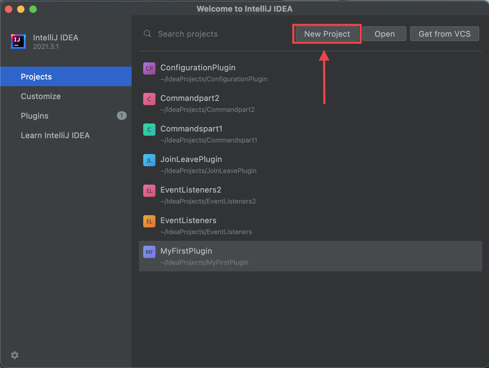
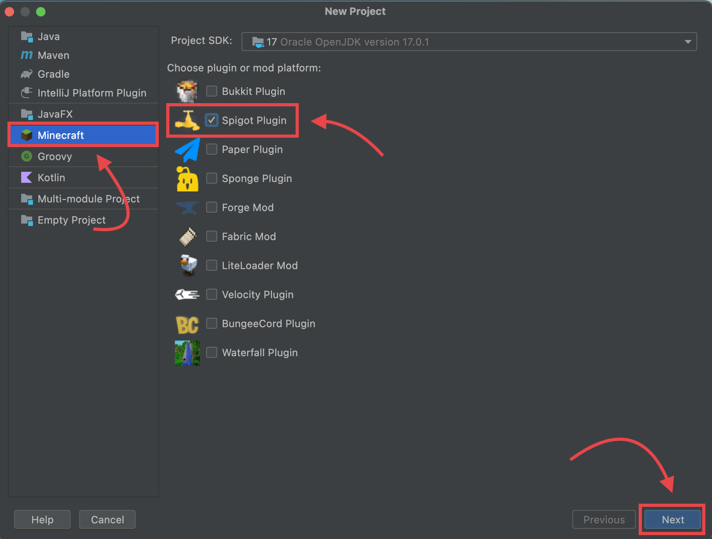
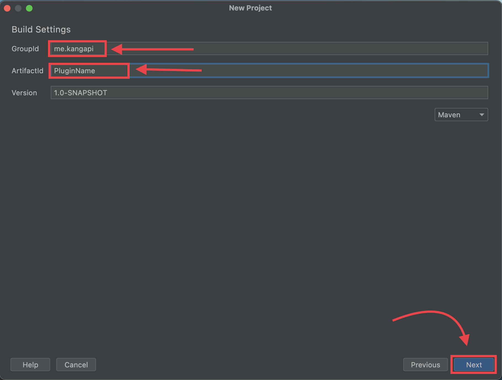
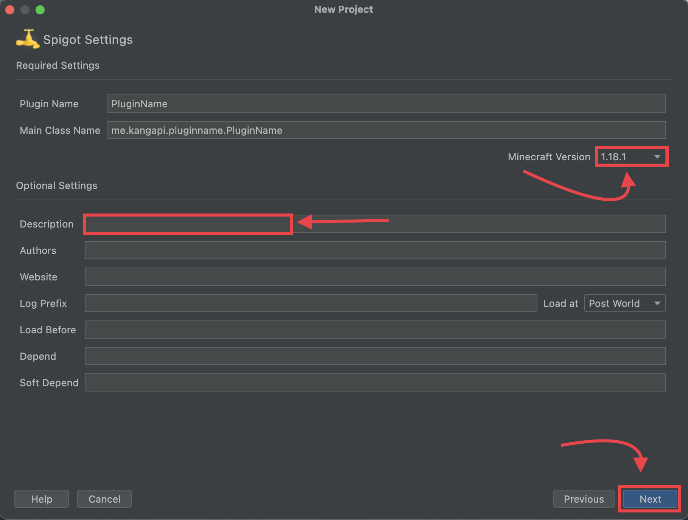
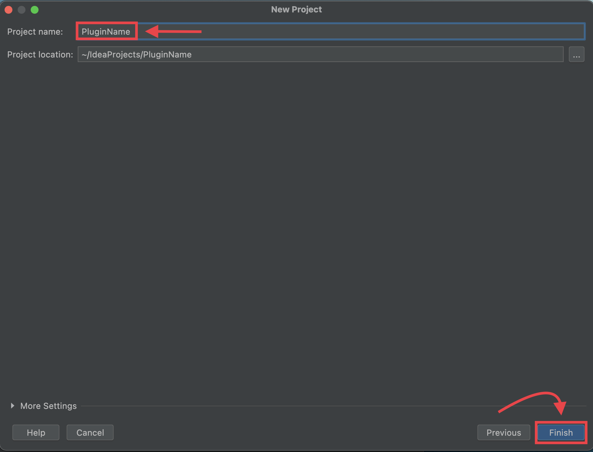

## Requirement

* [IntelliJ IDEA](https://www.jetbrains.com/fr-fr/idea/), The Community edition is sufficient
* The plugin [Minecraft Developement](https://plugins.jetbrains.com/plugin/8327-minecraft-development) for IntelliJ IDEA

## Create a new project

1. Click on **new project**
    
2. Select **Minecraft** and **Spigot Plugin**
    
3. Enter `me.kangapi` in the field **GroupId** and a `PluginName` in **ArtifactId** and click **Next**
    
4. You can change the **Minecraft Version** and set a **Description**
    
5. Enter the same **Plugin Name** as in step 4 and click **Finish**
    

## Run a Project

Click on the **green play button**
    