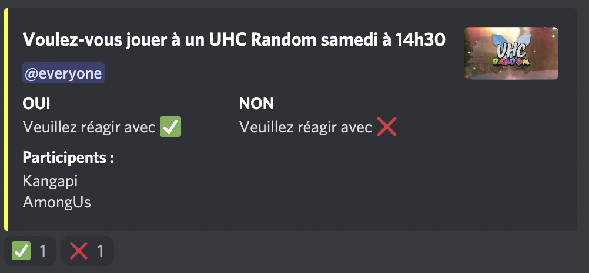
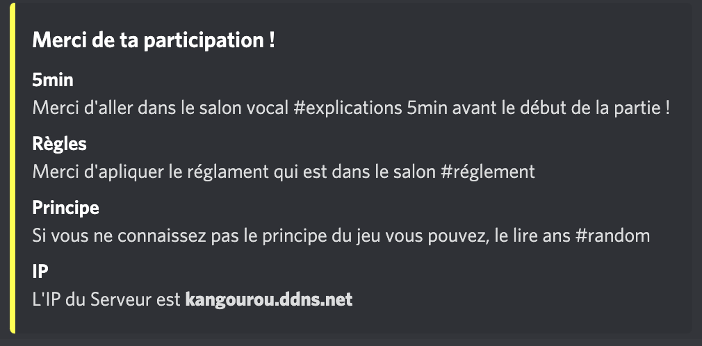
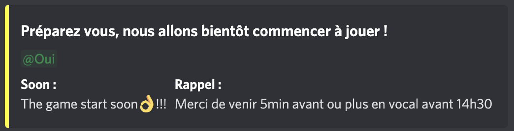

## Le principe

Le préfixe du bot (le caractère avant la commande) est **?**.
* La première commande est `?ouinon` lors de l'execution de celle-ci le message est supprimé, le role `je n'ai pas répondu` est donné à tous les joueurs et l'embed du bot apparaît :
  
  Lorsque un utilisateur cllique sur la réaction ✅, il reçoit :
  * le rôle `je participe`
  * un message du bot 
  * son nom s'affiche sur l'embed du bot

  Lorsque un utilisateur cllique sur la réaction ❌ :
  * son rôle `je participe` devient : `je ne participe pas`
  * son nom s'enlève de l'embed du bot
* Les autres commandes
  * La commande`?bientot` affiche un emebed pour que les joueurs se préparent à jouer 
  * La command `?roles` retire à les rôles : `je participe`, `je ne participe pas` et `je n'ai pas répondu` à tous les menbre du serveur 
  * Ainsi que d'autres commandes contenant des bugs !

## Le code

Le code a été réalisé entierement en **Javascript** graçe à [discord.js](https://discord.js.org/), le code est répartie dans un seul fichier. \
La première version est le bot pour un serveur **Among Us** voici [le repertoire **Github**](https://github.com/kangapi/Bot-Discord-AmongUs).\
La deuxième est le bot pour un serveur **Minecraft** voici [le repertoire **Github**](https://github.com/kangapi/Bot-Discord-Minecraft).

Pour lancer le bot il faut avoir [nodejs](https://nodejs.org/en/) et faire la commande `node index.js` dans un terminal !